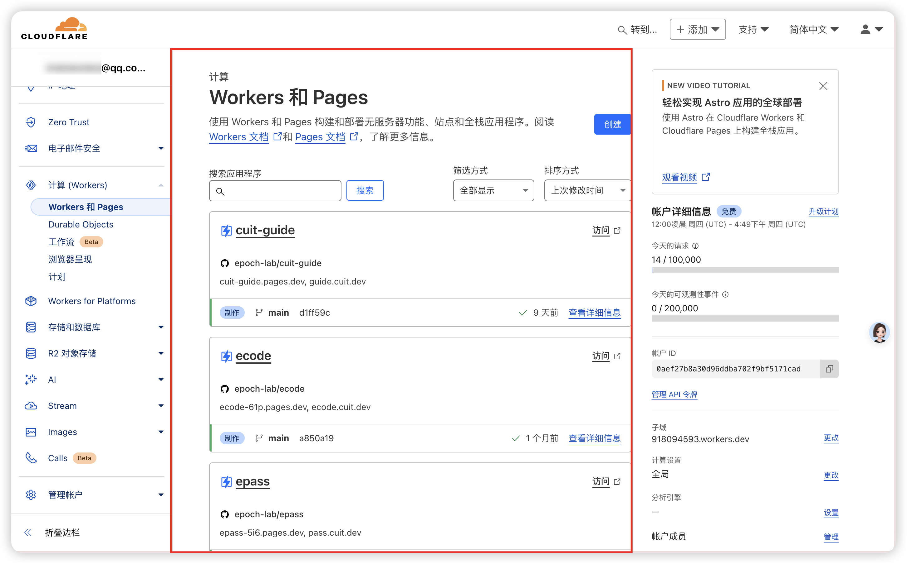
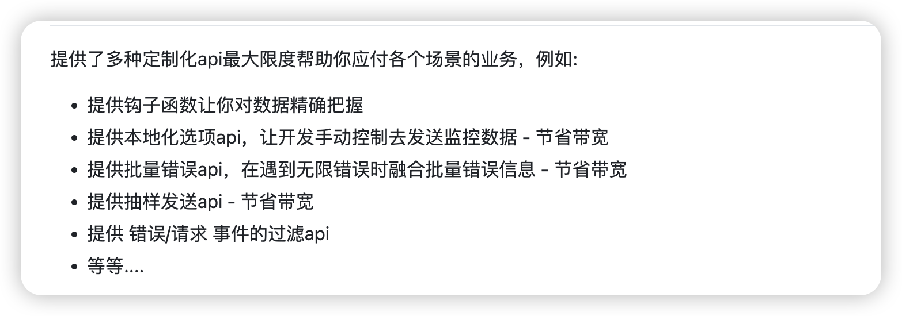
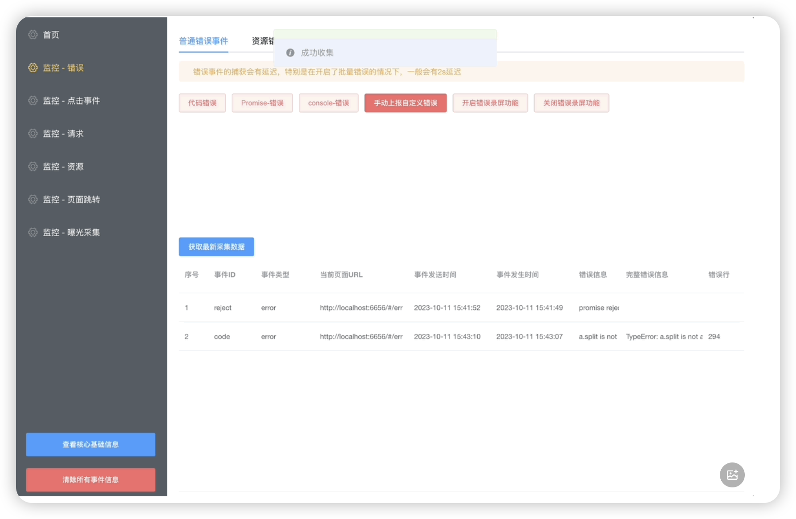
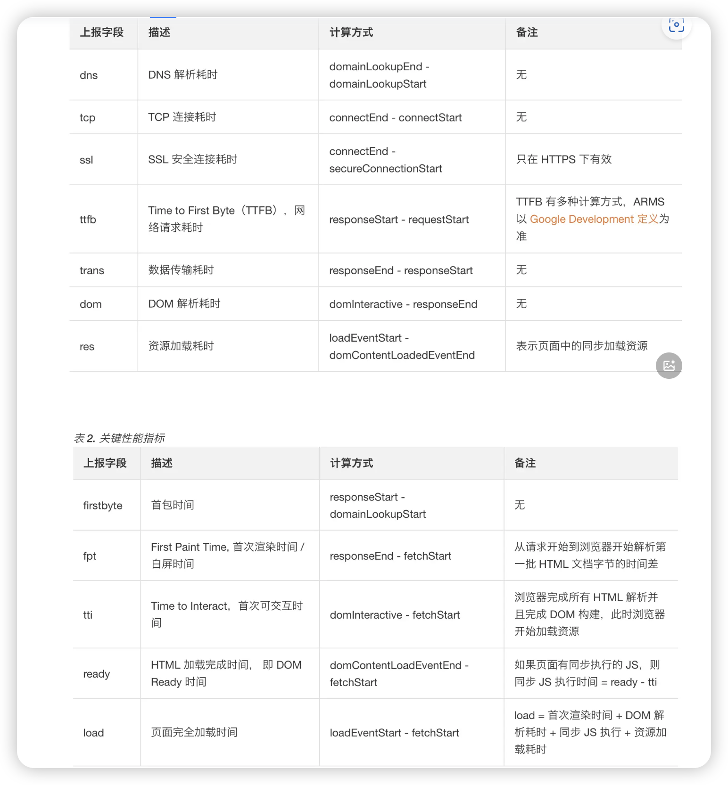
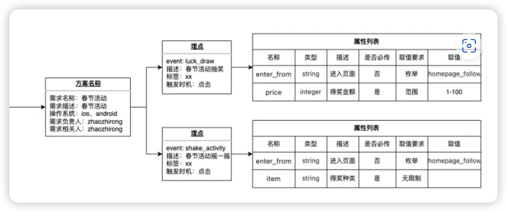

简单架构： SDK --- 获取数据--->  后端数据服务  ---> 前端数据平台

## 后端 to 前端 接口

数据平台，这里先不管SDK提供的数据；解耦，这里主要说数据平台和后端数据服务；

使用流程是：用户登录 -> 获取apikey，SDK要通过这个key才能使用（TODO： 通过key鉴权， 后面再做） -> 查看项目详细信息 


前后端接口基本类型：
```ts
// 响应状态码枚举
export enum ResponseCode {
    SUCCESS = 200,           // 成功
    BAD_REQUEST = 400,      // 请求参数错误
    UNAUTHORIZED = 401,     // 未授权
    FORBIDDEN = 403,        // 禁止访问
    NOT_FOUND = 404,        // 资源不存在
    INTERNAL_ERROR = 500,   // 服务器内部错误
}

// 响应消息映射
export const ResponseMessage = {
    [ResponseCode.SUCCESS]: '操作成功',
    [ResponseCode.BAD_REQUEST]: '请求参数错误',
    [ResponseCode.UNAUTHORIZED]: '未授权',
    [ResponseCode.FORBIDDEN]: '禁止访问',
    [ResponseCode.NOT_FOUND]: '资源不存在',
    [ResponseCode.INTERNAL_ERROR]: '服务器内部错误',
}

// 基础响应接口
export interface BaseResponse<T = any> {
    code: ResponseCode;          // 状态码
    message: string;            // 提示信息
    data?: T;                   // 响应数据
    timestamp?: number;         // 时间戳
    requestId?: string;         // 请求ID，用于追踪
}
```

### 需求列表

目前的需求：
- 用户登录，获取apikey
- 简单的分项目展示： 就是用户的项目列表

- SDK信息展示，展示用户使用引入了的，有效的SDK信息
- 错误展示 error.ts
- 性能监控 performance.ts
- 用户行为监控 userBehavior.ts


后续再做的东西：
- 白屏监控 whiteScreen.ts
- 自定义事件监控 customEvent.ts

#### SDK信息展示

```ts
export interface SDKInfo extends BaseResponse{
    name: string;
    version: string;
    description: string;
    // apikey: string; // 这个是敏感信息, 不能返回，先按照放在请求头中简单做
}
```
依次为例：
后端传的接口举例应该是：
```ts
{
    code: 200,
    message: "操作成功",
    data: {
        name: "Analytics SDK",
        version: "1.0.0",
        description: "数据分析统计SDK",
    },
    timestamp: 1710469831000,
    requestId: "req_abc123def456"
}

// apikey 的安全性传递很有的说，这里先不考虑，先按照放在请求头里处理
```


#### 错误监控

感觉会有一大堆的冗杂信息，需要数据清洗, 毕竟一些报错多数开发者会选择忽略，这里需要好好设计一下的；

待设计：
- 错误忽略
- 错误合并， 比如同一个错误， 多次上报， 只展示一次，并且后端需要记录错误上报次数；超过一定次数后，要打上tag（TODO： tag系统）标记异常
- 错误展示， 比如错误类型， 错误信息， 错误堆栈， 错误发生时间， 错误发生页面， 错误发生用户， 错误上报次数， 错误上报次数

参考：



##### 具体实现：
前端使用一个list, 推荐table组件即可， 展示错误信息， 点击错误信息， 展示错误详情；

推荐技术选型： tailwind css + haroui ，里面自带视效很不错的组件

<https://www.heroui.com/docs/components/table>



##### 字段
```ts
// 错误严重程度枚举
enum ErrorSeverity {
    LOW = 'low',
    MEDIUM = 'medium',
    HIGH = 'high',
    CRITICAL = 'critical'
}

// 错误状态
enum ErrorStatus {
    OPEN = 'open',           // 新建
    IN_PROGRESS = 'progress',// 处理中
    IGNORED = 'ignored',     // 已忽略
    RESOLVED = 'resolved'    // 已解决
}


// 错误详情接口
interface ErrorDetail {
    id: string;                     // 错误唯一ID
    type: string;                   // 错误类型 (如 "TypeError", "SyntaxError" 等)
    message: string;                // 错误信息
    stack: string;                  // 错误堆栈
    timestamp: number;              // 错误发生时间
    url: string;                    // 错误发生页面URL
    userId?: string;                // 错误发生用户ID
    userAgent: string;              // 用户浏览器信息
    count: number;                  // 错误发生次数
    lastOccurrence: number;         // 最后一次发生时间
    severity: ErrorSeverity;        // 错误严重程度
    status: ErrorStatus;            // 错误状态
    environment: string;            // 环境（production/staging/development）
    metadata: {                     // 额外信息
        browser: string;
        os: string;
        device: string;
        // ... 其他元数据
    };
    tags: string[];                 // 标签
}

// 错误列表响应接口
interface ErrorListResponse extends BaseResponse {
    data: {
        items: ErrorDetail[];
        total: number;
        page: number;
        pageSize: number;
    }
}
```

TODO： 后端数据库设计以及接口设计

#### 性能监控
performance.ts


#### 行为监控
userBehavior.ts
breadcrumbs.ts 

描述就是，监控用户行为， 比如点击， 输入， 等等；

一个觉得比较有意思的设计是，“用户行为栈”，意思是
内容也许比较多，详情可以通过一个table里面嵌套一个modal来展示，其他的类似以下这个图；




```ts
import type { BehaviorPriority, BehaviorType } from "@/shared/const"
import type { BaseResponse } from "@/request/base"
export interface BaseBehavior {
	id: string // 行为ID
	type: BehaviorType // 行为类型
	timestamp: number // 发生时间
	url: string // 页面URL
	userId?: string // 用户ID
	sessionId: string // 会话ID
	priority: BehaviorPriority // 行为优先级
	duration?: number // 持续时间（如果适用）
}

export interface ClickBehavior extends BaseBehavior {
	type: BehaviorType.CLICK
	title: string // 事件名
	target: {   
		tagName: string // 元素标签
		className: string // 类名
		elementId: string // 元素ID
		text: string // 元素文本
	}
	position: {
		x: number
		y: number
	}
}

export interface ScrollBehavior extends BaseBehavior {
	type: BehaviorType.SCROLL
}

export interface ConsoleBehavior extends BaseBehavior {
	type: BehaviorType.CONSOLE
}

export interface ApiRequestBehavior extends BaseBehavior {
	type: BehaviorType.API_REQUEST
}

export interface ResourceBehavior extends BaseBehavior {
	type: BehaviorType.RESOURCE
}

export interface HistoryBehavior extends BaseBehavior {
	type: BehaviorType.HISTORY
}
export interface InputBehavior extends BaseBehavior {
	type: BehaviorType.INPUT
}

export interface PageViewBehavior extends BaseBehavior {
	type: BehaviorType.PAGE_VIEW
}
export interface CustomBehavior extends BaseBehavior {
	type: BehaviorType.CUSTOM
}

// 行为栈中的行为类型
export type BehaviorStackItem =
	| ClickBehavior
	| ScrollBehavior
	| ConsoleBehavior
	| ApiRequestBehavior
	| ResourceBehavior
	| HistoryBehavior
	| InputBehavior
	| PageViewBehavior
	| CustomBehavior

// 行为查询参数
export interface BehaviorQueryParams {
	sessionId?: string
	userId?: string
	startTime?: number
	endTime?: number
	types?: BehaviorType[]
	priority?: BehaviorPriority
	page?: number
	pageSize?: number
}

// 行为列表响应
export interface BehaviorListResponse extends BaseResponse {
	data: {
		items: BehaviorStackItem[]
		total: number
		page: number
		pageSize: number
	}
}

```


```ts
/**
 * 用户行为栈事件类型
 */
export enum BehaviorType {
	CLICK = "UI.Click", // 点击事件
	INPUT = "input", // 输入事件
	SCROLL = "scroll", // 滚动事件
	CONSOLE = "Console", // 调试信息，有点脏，考虑删除；
	API_REQUEST = "api", // API请求
	RESOURCE = "Resource", // 资源加载
	HISTORY = "history", // 页面跳转, 路由变化
	PAGE_VIEW = "PageView", // 页面加载
	CUSTOM = "Custom", // 自定义事件
}

/**
 * 重写的事件类型
 */
export enum eventTypes {
	// 网络请求
	API_REQUEST = "api", // API请求, 包含xhr和fetch

	//  调试信息收集（CONSOLE）
	CONSOLE = "console",

	// 页面信息收集（DOM），通过事件委托或重写 addEventListener 实现
	DOM = "dom",

	// 监控history.pushState、replaceState 等等，监控页面路由变化
	HISTORY = "history",

	// 监控错误，捕获未被 try-catch 捕获的 JavaScript 错误， 通过window.onerror 或 ErrorEvent 监听实现
	ERROR = "error",

	// 监听url哈希变化， 通过window.onhashchange 事件监听
	HASHCHANGE = "hashchange",

	// 监控未被处理的Promise拒绝，通过window.onunhandledrejection 事件监听
	UNHANDLEDREJECTION = "unhandledrejection",

	// 监控Vue框架的错误，通过处理机制监听
	VUE = "Vue",

	// 监控React框架的错误，通过处理机制监听
	REACT = "React",

	// 监控代码错误
	CODE_ERROR = "Code Error",

	// 自定义事件
	CUSTOM = "Custom",
}

/**
 * 行为优先级
 */
export enum BehaviorPriority {
    LOW = 'low',
    MEDIUM = 'medium',
    HIGH = 'high'
}

```

## SDK to 后端 接口


